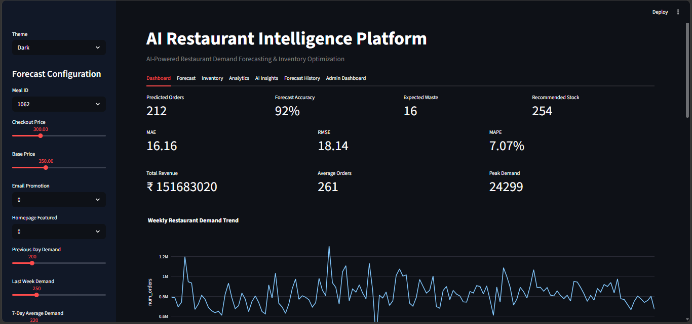
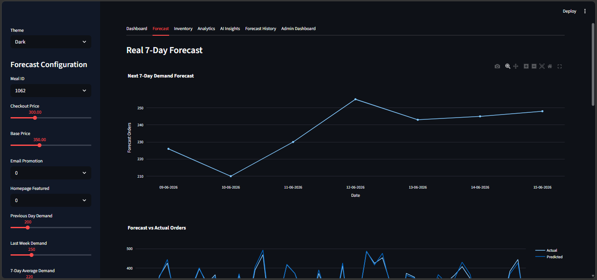
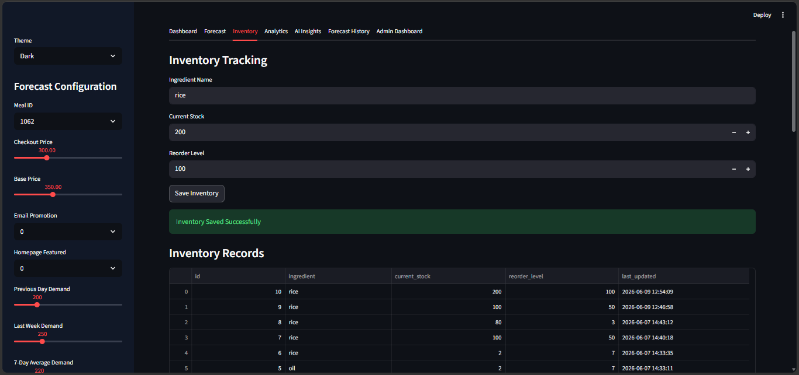
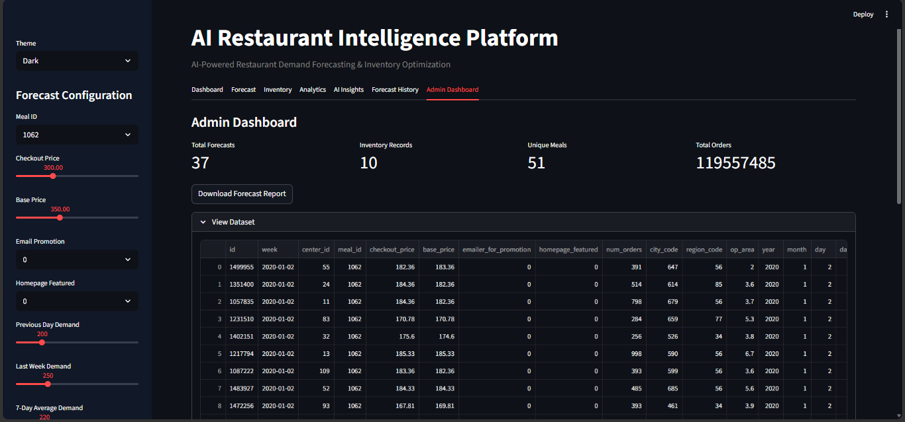
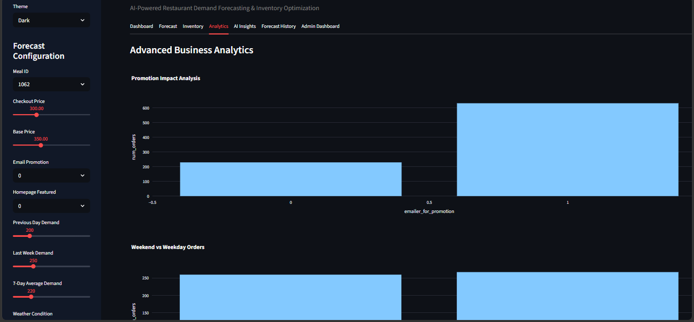

# AI Restaurant Intelligence Platform

## Project Overview

The AI Restaurant Intelligence Platform is a machine learning-based application designed to help restaurants forecast menu demand, optimize inventory, reduce food waste, and improve procurement planning. The system leverages historical restaurant order data and time-series forecasting techniques to generate accurate demand predictions and support data-driven business decisions.

The application integrates machine learning, business analytics, inventory management, audit logging, and interactive visualizations into a unified dashboard built using Streamlit.

---

## Project Objective

The objective of this project is to develop an AI-powered Restaurant Menu Demand Forecasting and Inventory Optimization System that helps restaurants:

* Predict future menu demand
* Reduce food wastage
* Optimize inventory levels
* Improve procurement planning
* Support operational decision-making
* Enhance overall restaurant efficiency and profitability

---

## Key Features

### Demand Forecasting

* XGBoost-based demand prediction model
* Time-series forecasting approach
* Weather and festival impact adjustments
* Future demand estimation

### Inventory Management

* Inventory tracking system
* Stock level monitoring
* Reorder level management
* Inventory recommendations

### Procurement Planning

* Recommended stock calculations
* Procurement quantity estimation
* Understock and overstock detection

### Waste Prediction

* Food wastage estimation
* Demand-based inventory recommendations

### Forecast History

* SQLite-based forecast storage
* Historical prediction tracking

### Audit Logging

* Inventory activity monitoring
* Forecast generation tracking
* Administrative audit records

### Business Analytics

* Weekly demand trends
* Rolling average analysis
* Promotion impact analysis
* Weekend demand analysis
* Seasonal demand patterns

### Reporting

* Forecast report downloads
* Business insights dashboard

### User Interface

* Streamlit web application
* Dark and Light themes
* Interactive visualizations using Plotly

---

## Technologies Used

### Programming Language

* Python

### Machine Learning

* XGBoost
* Scikit-Learn

### Data Processing

* Pandas
* NumPy

### Visualization

* Plotly

### Database

* SQLite

### Web Framework

* Streamlit

---

## Machine Learning Workflow

### Week 1 – Data Collection and Exploratory Data Analysis

* Data collection and integration
* Data cleaning and preprocessing
* Exploratory Data Analysis (EDA)
* Demand trend analysis
* Category-wise demand analysis
* Cuisine popularity analysis
* Promotion impact analysis
* Pricing analysis
* Operational area analysis

### Week 2 – Feature Engineering and Time-Series Preparation

* Date feature extraction
* Month, day, and weekday creation
* Weekend indicator generation
* Lag feature creation
* Rolling average feature generation
* Categorical variable encoding
* Time-series dataset preparation
* Sequential train-test splitting

### Week 3 – Model Training and Evaluation

* XGBoost model development
* Model training
* Forecast generation
* Model evaluation
* Model persistence using Joblib
* Streamlit deployment integration

---

## Time-Series Features Used

### Calendar Features

* Year
* Month
* Day
* Day of Week
* Weekend Indicator

### Lag Features

* Previous Demand (Lag 1)
* Previous Week Demand (Lag 7)

### Rolling Statistics

* Rolling Mean Demand

### Business Features

* Checkout Price
* Base Price
* Promotion Indicators
* Homepage Featured Status

### Restaurant Features

* Meal ID
* Center ID
* City Code
* Region Code
* Operational Area

---

## Project Structure

```text
Food-Demand-Forecasting/

├── app.py

├── requirements.txt

├── README.md

├── restaurant.db

│

├── data/

│   └── processed_data.csv

│

├── models/

│   └── xgboost_model.pkl

│

├── notebooks/

│   ├── Week1_EDA.ipynb

│   ├── Week2_Feature_Engineering.ipynb

│   └── Week3_Model_Training.ipynb

│

└── database/

    ├── db.py

    ├── schema.py

    └── audit_log.py
```
📸 Screenshots

## Dashboard



## Forecast



## Inventory



## Admin Dashboard



## Analytics



## Database Tables

### forecast_history

Stores all generated forecasts.

| Column           | Description       |
| ---------------- | ----------------- |
| id               | Forecast ID       |
| meal_id          | Meal Identifier   |
| predicted_orders | Forecasted Demand |
| model_used       | Prediction Model  |
| forecast_date    | Timestamp         |

---

### inventory

Stores inventory records.

| Column        | Description       |
| ------------- | ----------------- |
| id            | Inventory ID      |
| ingredient    | Ingredient Name   |
| current_stock | Available Stock   |
| reorder_level | Reorder Threshold |
| last_updated  | Timestamp         |

---

### audit_logs

Stores system activities.

| Column     | Description      |
| ---------- | ---------------- |
| id         | Log ID           |
| action     | Activity Type    |
| details    | Activity Details |
| created_at | Timestamp        |

---

## How to Run the Project

### Step 1: Clone Repository

```bash
git clone <repository-url>
```

### Step 2: Install Dependencies

```bash
pip install -r requirements.txt
```

### Step 3: Create Database

```bash
python -m database.schema
```

### Step 4: Run Streamlit Application

```bash
streamlit run app.py
```

---

## Business Benefits

* Reduces food wastage
* Improves inventory utilization
* Supports procurement planning
* Enhances operational efficiency
* Improves forecasting accuracy
* Supports business decision-making
* Reduces stock shortages
* Improves restaurant profitability


**AI-Powered Restaurant Menu Demand Forecasting and Inventory Optimization System**
